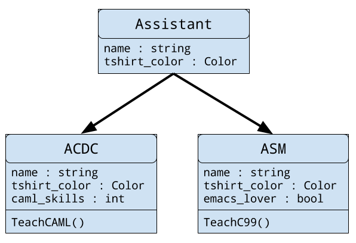

\titlepage

## Overview
\tableofcontents

# Introduction

## Quick characteristics

> - Multi-paradigm (mostly object oriented)
> - Strong typing
> - Developped by Microsoft
> - Strongly inspired by Java and C++

## History
### Origin

> - Created for .NET framework as a replacement for `SMC`
> - January 1999: Anders Hejlsberg forms a team to build a new language
> - July 2000: Public annoucement of .NET and C# during the Professional Developpers Conference

### Versions

| C# version | Release date  | Adding                                        |
|------------|---------------|-----------------------------------------------|
| 1.0        | January 2002  | Lot of things                                 |
| 2.0        | June 2006     | `static`, `null`, generics, delegates         |
| 3.0        | November 2007 | `var`, automatic properties, initializers     |
| 4.0        | April 2010    | Optional parameters                           |
| 5.0        | August 2012   | Not so much                                   |
| 6.0        | July 2015     | String interpolation, Dictionnary initializer |
| 7.0        | March 2017    | Local functions                               |

### Name

> - Originally named `Cool` (C-like Object Oriented Language)
> - Musical notation: semitone higher in pitch
> - `C` => `C++` => `C++++`

## Compilation
### Classic compilation

A classic compilation diagram would look like this :


### C# compilation


### What's the difference ?

> - C# uses an intermediate language named `MSIL`
> - The MSIL generated code is named "Assembly"
> - This code is compiled using JIT (Just In Time compiler)
> - The final is a binary program (machine language)

## .NET

# Syntax

## Syntax

## Types initialization

> - Undeclared
> - `<type> <name>;`
> - Declared but still uninitialized
> - `<name> = <value>;`
> - Initialized

## Types initialization

> - Undeclared
> - `<type> <name> = <value>`
> - Initialized

## Arrays

```cs
<type>[] <name>;
<type>[] <name> = <variable>;
<type>[] <name> = new <type>[size];
```

## Examples

```cs
char dab = '\t';
int theAnswer = 42;
float goldNumber = 1.6180f;
string deadLine = "These violent deadlines have violent ends;"
bool  = true;

int[] random = new int[10];
int[] fibonacci = { 0, 1, 2, 3, 5, 8 };
```

# Imperative programming

## What is imperative?

# Object Oriented Programming

## What is OOP?

* A concept
* Patterns
* Create 'objects' from the patterns
* Object interaction

## A class

```cs
class ACDC
{
  //fields
  float _height;
  float _weight;
  bool _isMean;
  [...]
}
```

## A class with methods

```cs
class Student
{
  // fields
  string _name;
  float _height;
  float _weight;
  bool _isMean;
  Color _hairColor;

  // methods
  string GetName();
  void GoToClass();
  bool IsInClass();
  void Work();
}
```

## Example of using methods

```cs
public static void Main(string[] args)
{
  Student student = new Student();

  if (! student.IsInClass())
    student.GoToClass();
  else
    student.Work();
}
```

## Instantiating an object

* Instantiating is 'creating'
* the keyword: **new**
* the class constructor: a special method

## Constructor

* what is it?
* instanciate an object
* you can have several constructor per class
* there is a default one if none is given
* initialize the fields

## Example

```cs
class ACDC
{
  // fields
  string _name;
  int _height;
  int _age;
  [...]

  // method
  void AnswerQuestion();
  void Facepalm();
  [...]
}
```

## Example
```cs
class ACDC
{
  public ACDC()
  {
    this._name = "Cyril";
    this._height = 180;
    this._age = 2;
  }

  public ACDC(string name, int height, int age)
  {
    this._name = name;
    this._height = height;
    this._age = age;
  }
}
```

## Example

```cs
public static void Main(string[] args)
{
  ACDC cyril = new ACDC();
  ACDC cuebrick = new ACDC("Cuebrick", 280, 20);

  cyril.GetAge(); // returns 2
  cuebrick.GetAge(); // return 20
}
```

## Static fields

* Common to every instance of a class
* Cannot be accessed from instance
* Cannot be accessed with **this**.

##  Static Class

* Cannot be instantiated
* Every field is static

## Example

```cs
class ACDC
{
  public static int count;
  public ACDC()
  {
    ++count;
  }

  [...]
}
```

## Example

```cs
public static void Main(string[] args)
{
  ACDC garage = new ACDC();
  ACDC kirzie = new ACDC();

  ACDC.count; // count = 2;
}
```

# Inheritance

## Concept

> - Classes can inherit properties of other classes
> - The class that inherits is called "Child class"
> - The class from which the "Child class" inherits is called "Parent class"
> - Child classes can implement additionnal properties
> - Allows us to create a tree with our classes

## Visual example



## In Code

```cs
class Assistant
{
  public string nickname;

  public Assistant(string nickname)
  {
    this.nickname = nickname;
  }
}

class ACDC : Assistant
{
  public ACDC(string nickname): base(nickname)
  {
    /* No need to initialize this.nickname */
  }

  public void TeachCAML()
  {
    /* CAML magic */
  }
}

```

# Advanced C#

## Keywords

* `var`
* `typeof`
* and a lot more (`yield`, `explicit`, `try`, `unsafe`, `using`)

# var

```cs
ACDC acdc = new ACDC();
// is the same thing as
var acdc = new ACDC();
```

# var and null

```cs
var tetra = new ACDC();
tetra = null;

ACDC tetra = new ACDC();
tetra = null;

var tetra = null; // compilation failed
```

# typeof

```cs
```

